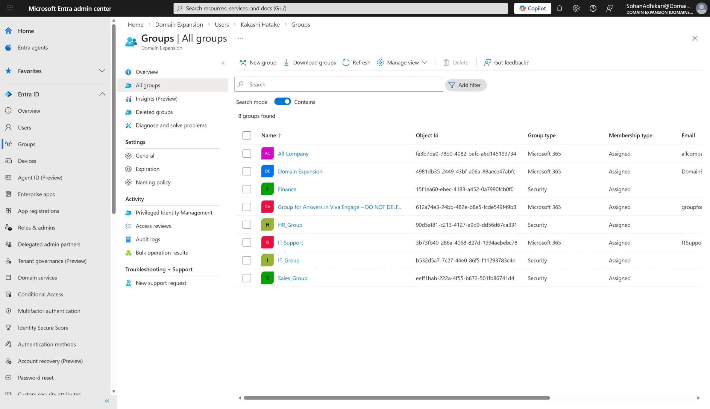
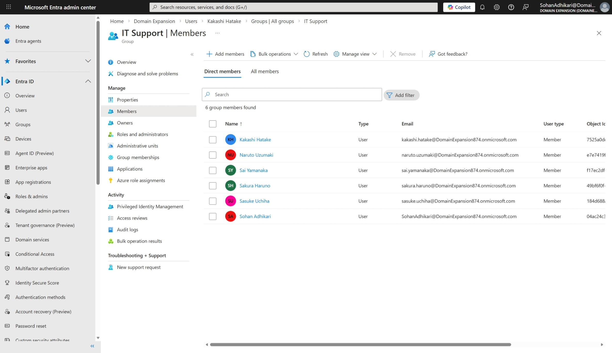

# Groups Management in Microsoft Entra ID

## Objective
To manage user access and permissions using groups in Microsoft Entra ID.

## Environment
- Platform: Microsoft Entra ID
- Domain: DomainExpansion874.onmicrosoft.com

## Steps Performed
- Navigated to the Groups section in Entra ID
- Created groups to organize users
- Added users to groups for access management

## Screenshots

### Groups List

### Group Members

## Outcome
Successfully organized users into groups to simplify access management.

## Key Learnings
- Groups allow efficient management of multiple users
- Access and permissions can be assigned at group level
- Group-based management reduces administrative effort