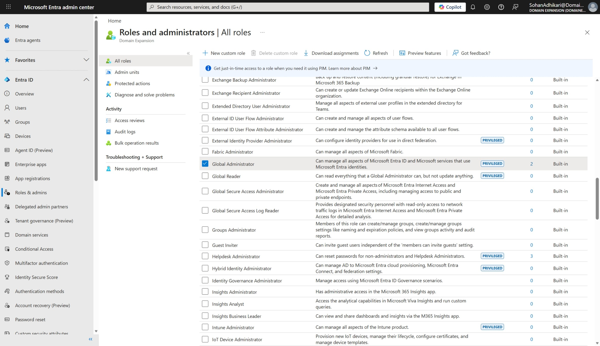
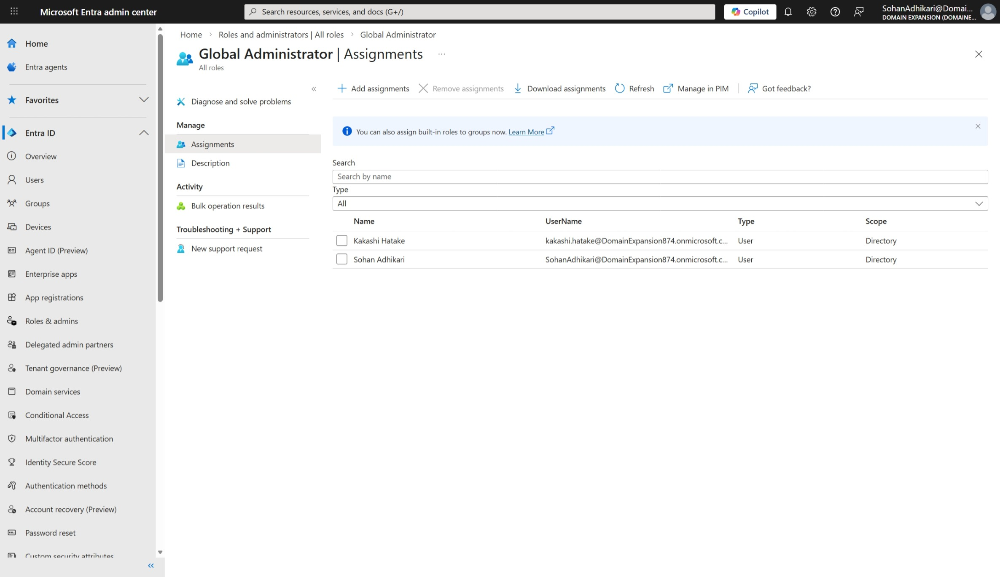

# Roles and Administrative Access in Microsoft Entra ID

## Objective
To manage administrative access and permissions using role-based access control in Microsoft Entra ID.

## Environment
- Platform: Microsoft Entra ID
- Domain: DomainExpansion874.onmicrosoft.com

## Steps Performed
- Navigated to Roles and Administrators section
- Reviewed available administrative roles
- Assigned Global Administrator role to a user

## Screenshots

### Roles List

### Global Administrator Role Assignment

## Outcome
Successfully assigned administrative privileges using role-based access control.

## Key Learnings
- Role-based access control (RBAC) ensures secure administration
- Global Administrator has full control over the Entra ID environment
- Assigning roles carefully is important for security