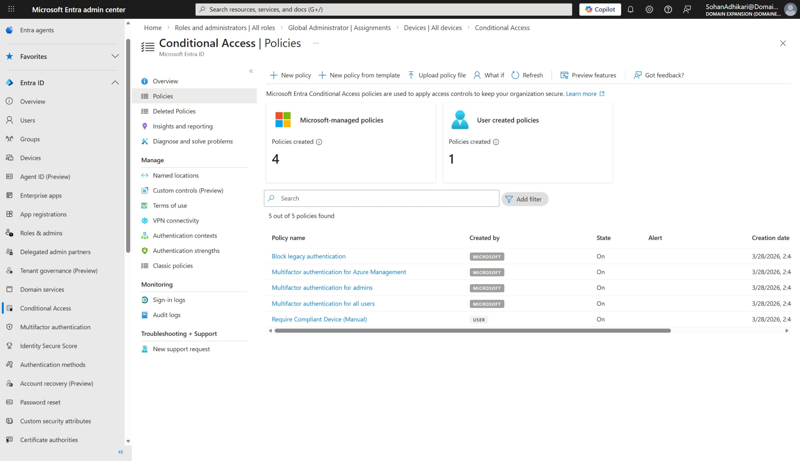
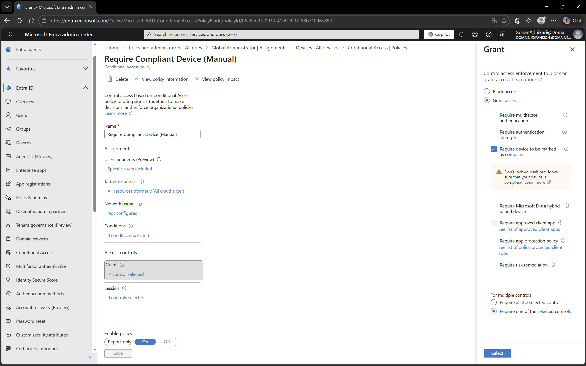

# Conditional Access in Microsoft Entra ID

## Objective
To enhance security by implementing Conditional Access policies in Microsoft Entra ID.

## Environment
- Platform: Microsoft Entra ID
- Domain: DomainExpansion874.onmicrosoft.com

## Steps Performed
- Navigated to Conditional Access in Entra ID
- Created and reviewed security policies
- Configured policies to enforce access controls such as multi-factor authentication (MFA)
- Applied policies to users or groups

## Screenshots

### Conditional Access Policies

### Policy Configuration

## Outcome
Successfully implemented Conditional Access policies to control user access and improve security.

## Key Learnings
- Conditional Access provides dynamic security controls
- Policies can enforce MFA and restrict access based on conditions
- It is a critical component of modern cloud security