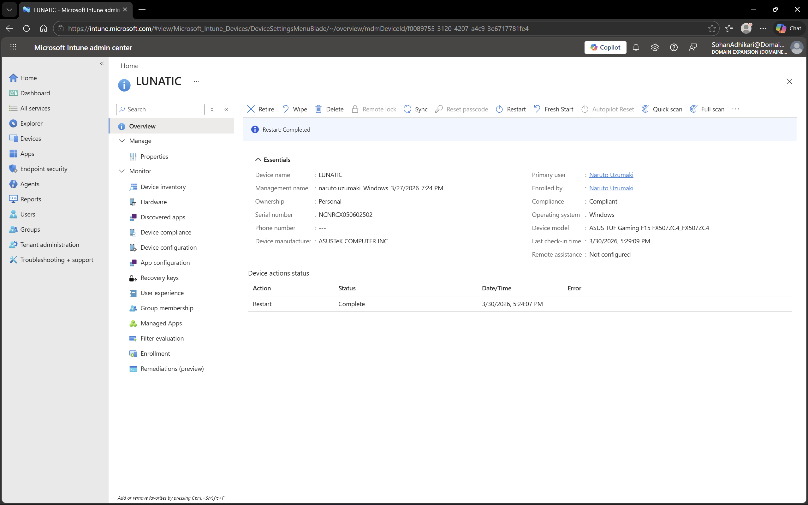

# Microsoft Intune - Device Actions

## Objective
To demonstrate remote management capabilities for enrolled devices using Microsoft Intune.

## Environment
- Platform: Microsoft Intune
- Domain: DomainExpansion874.onmicrosoft.com
- Integration: Connected with Microsoft Entra ID

## Steps Performed
- Navigated to the Devices section in Intune
- Selected an enrolled device
- Viewed and explored remote actions available:
  - Restart device
  - Sync device
  - Wipe device
- Verified actions were ready to perform (without executing destructive actions in home lab)

## Screenshots

### Device Actions Menu

## Outcome
Device actions were successfully reviewed, confirming the ability to remotely manage enrolled devices for maintenance, troubleshooting, or security purposes.

## Key Learnings
- Intune allows administrators to remotely manage devices
- Actions include restart, sync, and wipe
- Remote device actions improve IT support efficiency and security