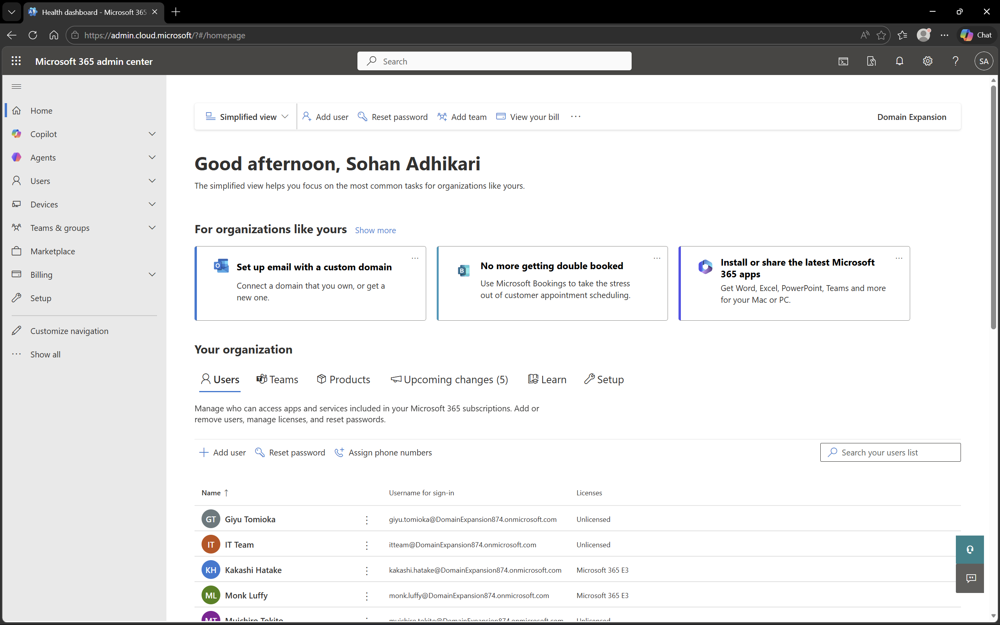

# Microsoft 365 - Overview

## Objective
To explore and understand the Microsoft 365 environment and its core administrative capabilities in a home lab setup.

## Environment
- Platform: Microsoft 365 Admin Center
- Domain: DomainExpansion874.onmicrosoft.com
- Integration: Connected with Microsoft Entra ID and Intune

## Overview
This setup represents a cloud-based productivity and identity management environment where users, licenses, services, and security are managed centrally through Microsoft 365.

## Screenshots

### Microsoft 365 Admin Dashboard

## Outcome
Successfully explored the Microsoft 365 Admin Center and its capabilities for managing users, services, and overall tenant environment.

## Key Learnings
- Microsoft 365 provides centralized administration for users and services
- It integrates with Entra ID for identity management
- It supports collaboration tools such as Exchange and Teams