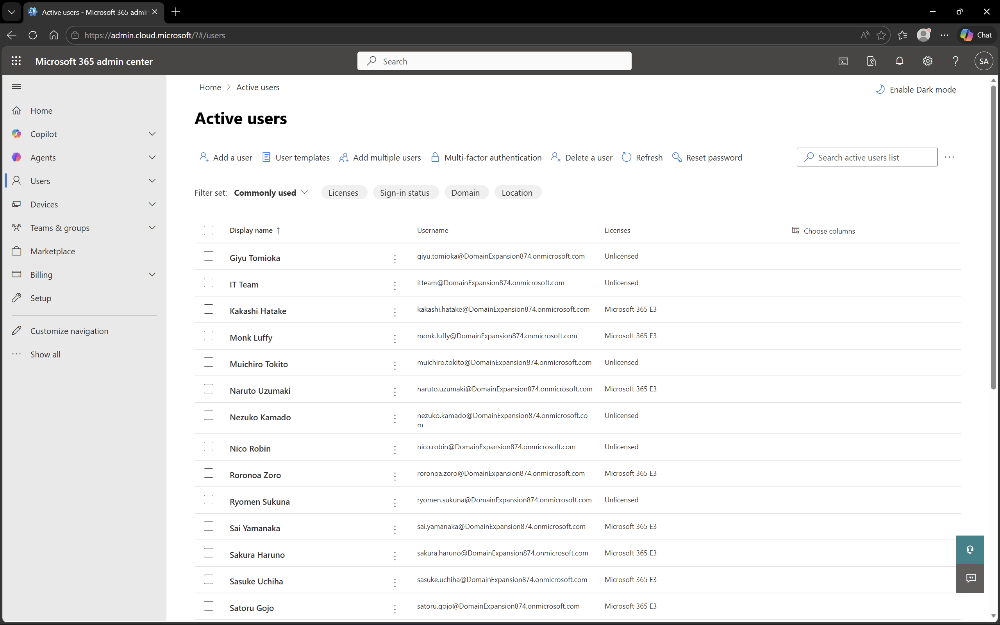
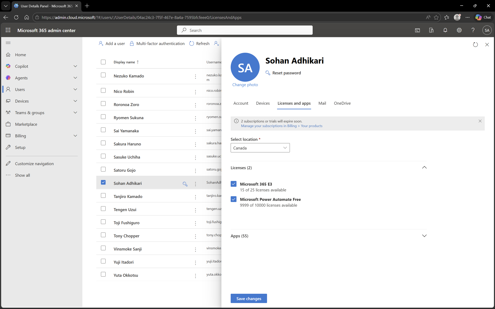

# User and License Management in Microsoft 365

## Objective
To manage users and assign licenses in Microsoft 365 for enabling access to services and applications.

## Environment
- Platform: Microsoft 365 Admin Center
- Domain: DomainExpansion874.onmicrosoft.com
- Integration: Connected with Microsoft Entra ID and Intune

## Steps Performed
- Navigated to the Users section in Microsoft 365 Admin Center
- Reviewed the list of users in the tenant
- Selected a user and assigned Microsoft 365 license
- Verified license assignment for access to services

## Screenshots

### Users List

### License Assignment

## Outcome
Successfully managed users and assigned licenses, enabling access to Microsoft 365 services.

## Key Learnings
- Users require licenses to access Microsoft 365 services
- License assignment enables features like email, Teams, and OneDrive
- Centralized user management simplifies administration