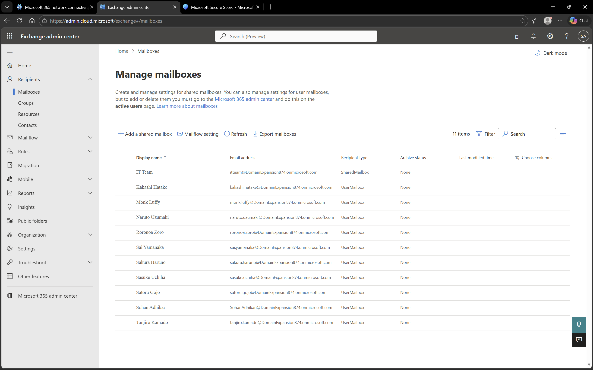
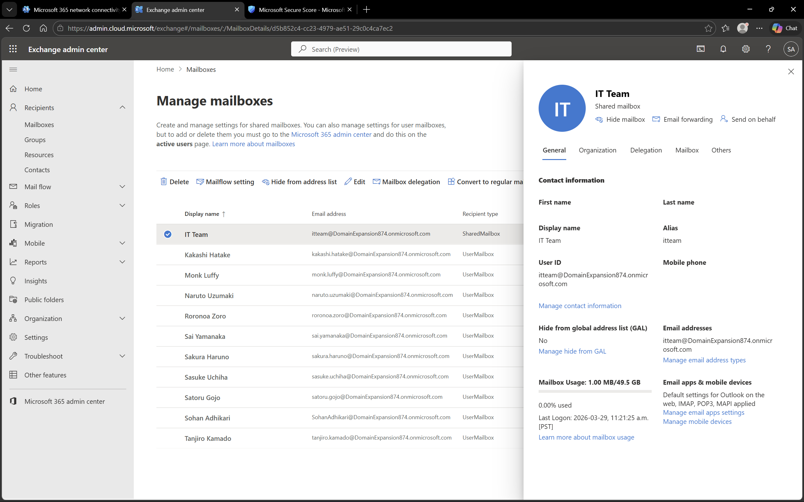

# Exchange Mailbox Management in Microsoft 365

## Objective
To manage and explore user mailboxes using Microsoft Exchange Online in Microsoft 365.

## Environment
- Platform: Microsoft 365 Admin Center (Exchange Online)
- Domain: DomainExpansion874.onmicrosoft.com
- Integration: Connected with Microsoft Entra ID and Intune

## Steps Performed
- Navigated to Exchange Admin Center
- Reviewed list of user mailboxes
- Opened a mailbox to view details such as email address and settings
- Verified mailbox configuration for users

## Screenshots

### Mailboxes List

### Mailbox Details

## Outcome
Successfully explored and verified mailbox configurations for users in Microsoft 365.

## Key Learnings
- Exchange Online manages user email services in Microsoft 365
- Each licensed user is assigned a mailbox
- Mailbox management is essential for communication and collaboration