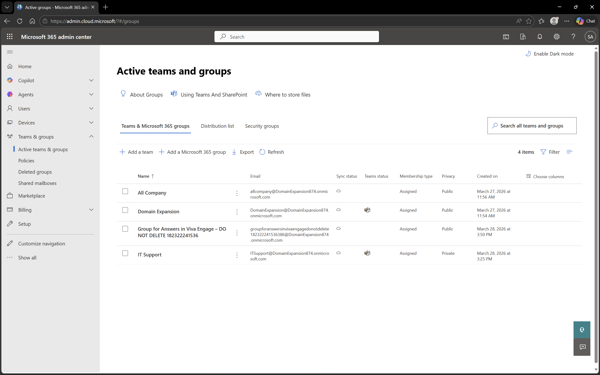
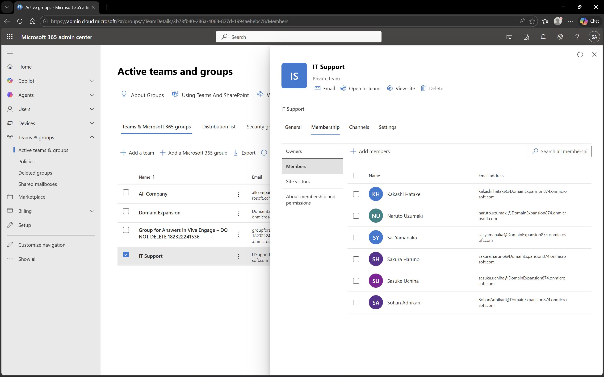

# Microsoft Teams Management in Microsoft 365

## Objective
To manage collaboration and communication by creating and configuring teams in Microsoft Teams.

## Environment
- Platform: Microsoft 365 Admin Center (Teams)
- Domain: DomainExpansion874.onmicrosoft.com
- Integration: Connected with Microsoft Entra ID and Intune

## Steps Performed
- Navigated to Microsoft Teams Admin Center
- Reviewed list of available teams
- Created or managed a team
- Added users as members to the team

## Screenshots

### Teams List

### Team Members

## Outcome
Successfully managed teams and added users to enable collaboration within the organization.

## Key Learnings
- Microsoft Teams enables communication and collaboration
- Teams can include multiple users and roles
- Managing teams improves productivity and teamwork