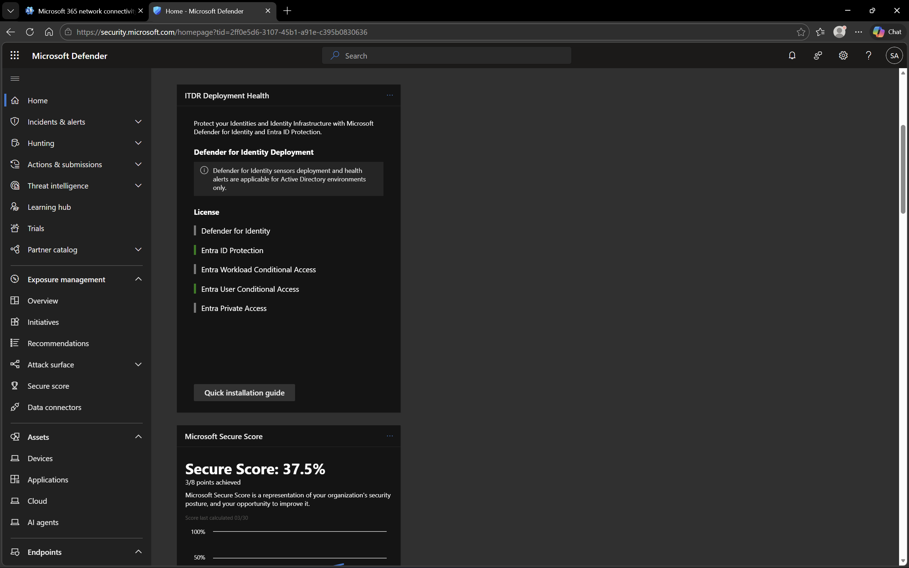
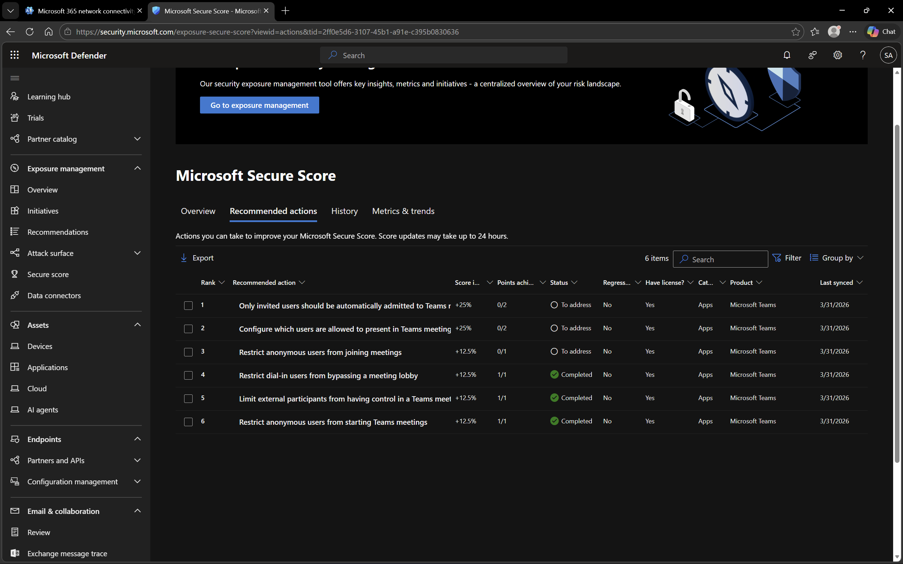

# Security and Compliance in Microsoft 365

## Objective
To explore and understand security posture and recommended improvements using Microsoft 365 Security tools.

## Environment
- Platform: Microsoft 365 Security / Defender
- Domain: DomainExpansion874.onmicrosoft.com
- Integration: Connected with Microsoft Entra ID and Intune

## Steps Performed
- Navigated to Microsoft 365 Security Center
- Reviewed Security Score dashboard
- Analyzed recommended actions to improve security posture
- Explored basic security configurations

## Screenshots

### Security Score Dashboard

### Recommended Actions

## Outcome
Successfully reviewed the organization’s security posture and identified areas for improvement.

## Key Learnings
- Security Score provides a measurable view of security posture
- Microsoft 365 suggests actionable steps to improve security
- Continuous monitoring and improvement are essential for a secure environment