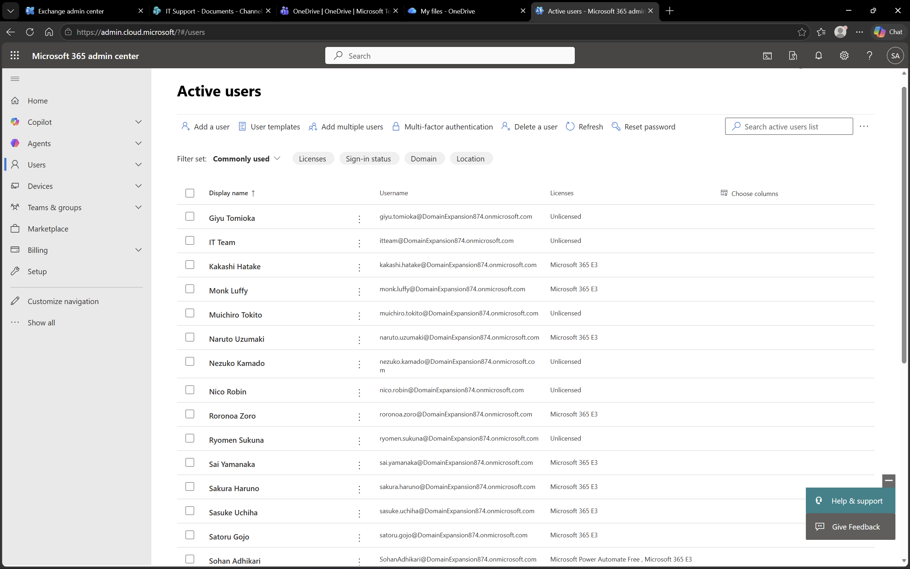
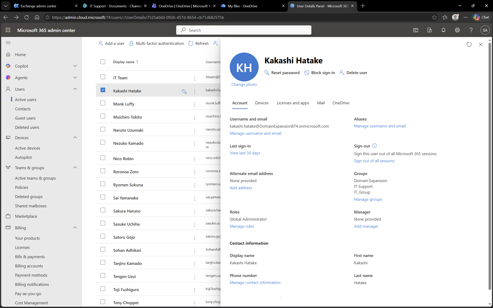
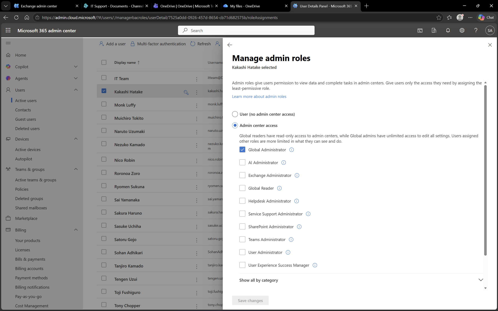

# Microsoft 365 – Users and License

## Objective
To explore user management and license assignment in Microsoft 365.

## Environment
- Platform: Microsoft 365
- Domain: DomainExpansion874.onmicrosoft.com

## Overview
This section demonstrates managing users, assigning licenses, and configuring roles within Microsoft 365 Admin Center.

## Steps Performed
- Navigated to Users → Active Users
- Reviewed the list of users
- Opened user details to check licenses and roles
- Checked role assignments for administrative privileges

## Screenshots

### User List

### User Details

### Roles List

### Global Admin Assignment

## Outcome
Successfully reviewed user accounts, licenses, and role assignments.

## Key Learnings
- Users can be assigned licenses to access specific services
- Roles like Global Admin provide administrative privileges
- Admin Center provides visibility into all user accounts and permissions