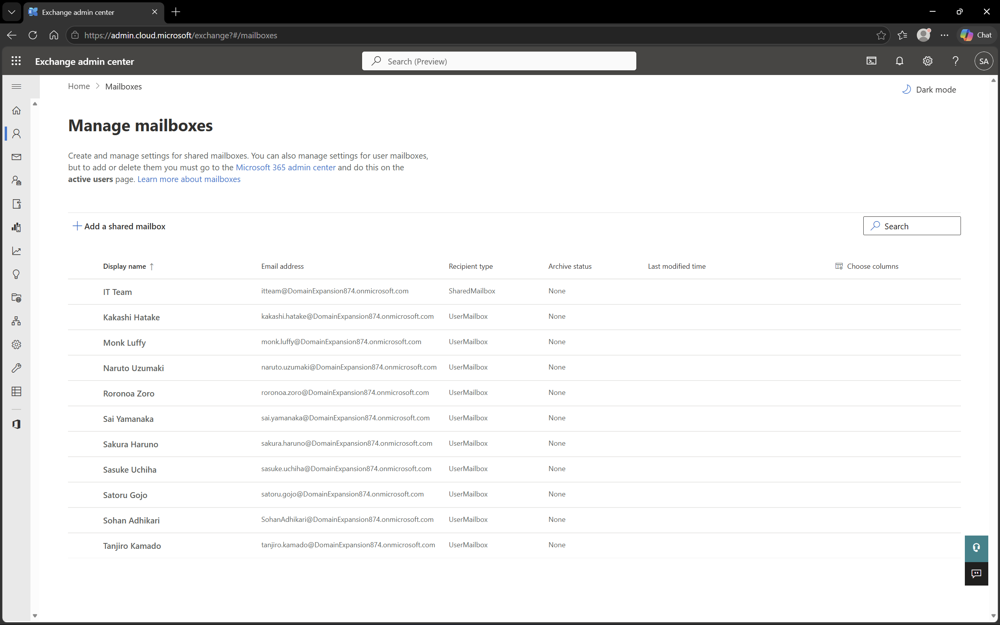
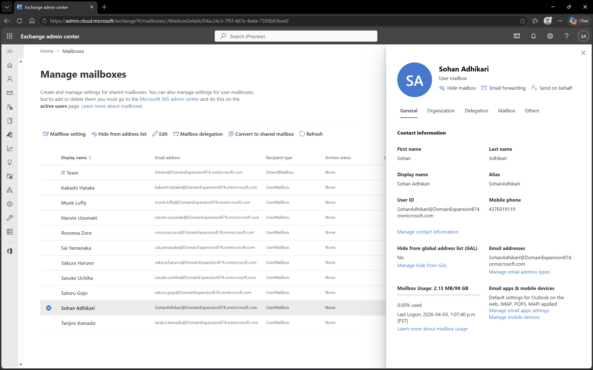
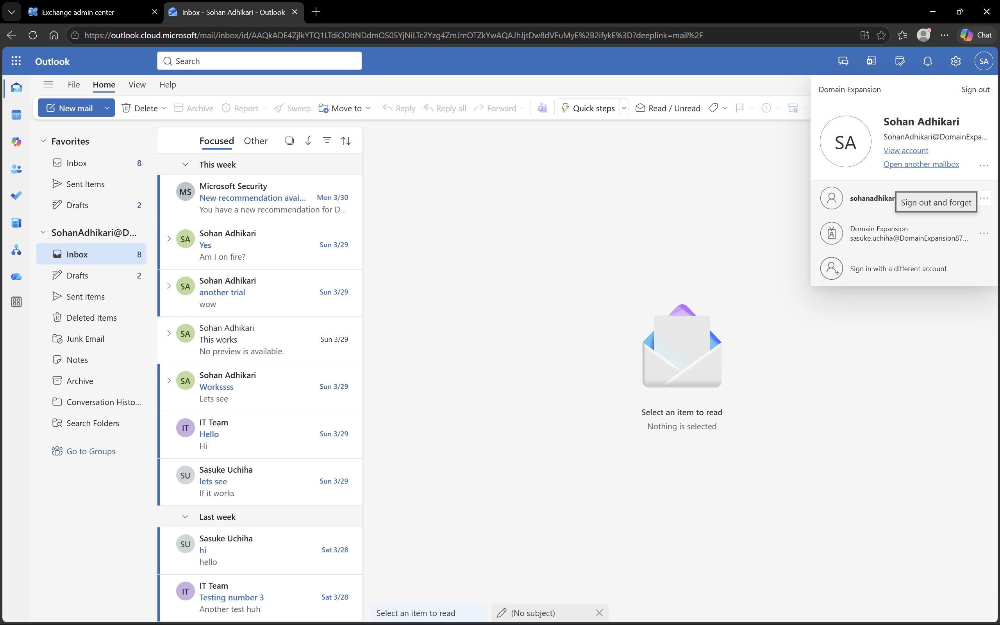

# Microsoft 365 – Exchange Online

## Objective
To explore email management and mailbox administration using Microsoft Exchange Online.

## Environment
- Platform: Microsoft Exchange Online
- Domain: DomainExpansion874.onmicrosoft.com
- Integration: Connected with Microsoft 365 and Entra ID

## Overview
Exchange Online provides cloud-based email services for sending, receiving, and managing emails.  
This setup allows administrators to manage mailboxes, monitor email flow, and ensure proper communication within the organization.

## Steps Performed
- Navigated to Exchange Admin Center
- Reviewed all user mailboxes
- Accessed mailbox details for a test user
- Sent and received test emails via Outlook

## Screenshots

### Mailbox List

### Mailbox Details

### Email Test

## Outcome
Successfully verified mailbox setup and email communication using Exchange Online.

## Key Learnings
- Exchange Online enables cloud-based email management
- User mailboxes are linked to Microsoft 365 accounts
- Email functionality can be tested to ensure proper flow