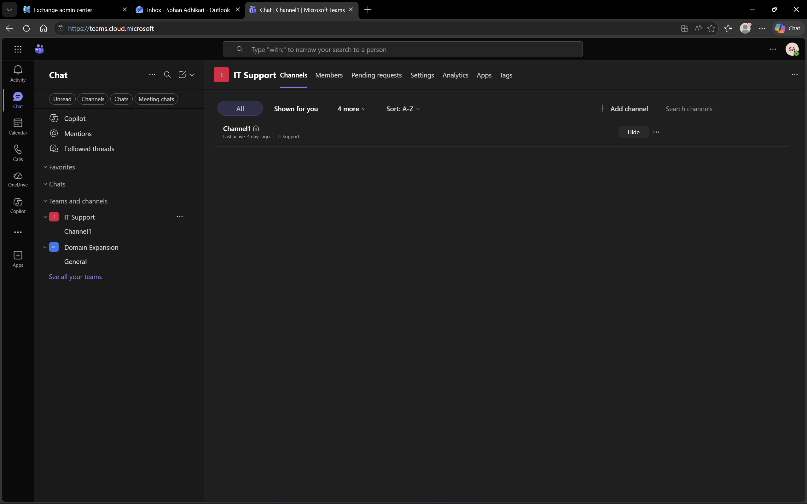
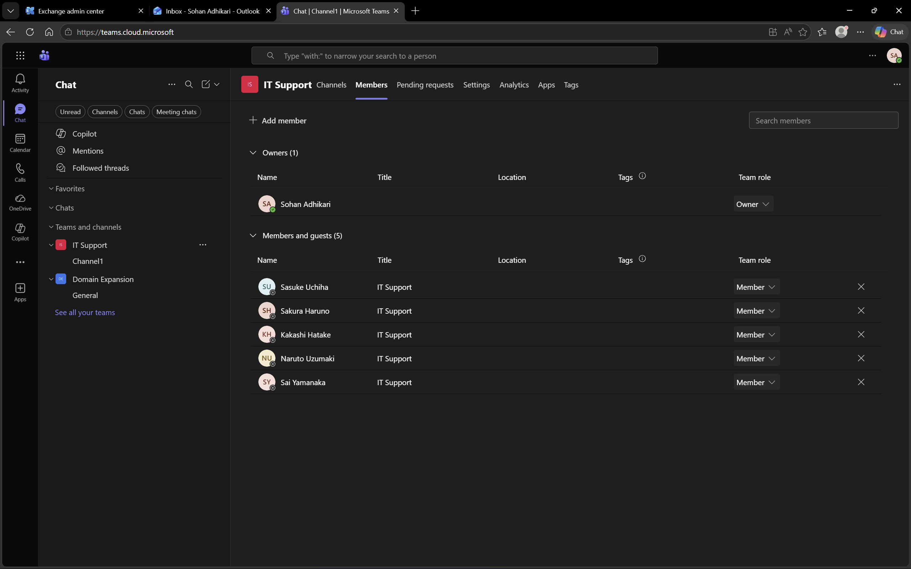
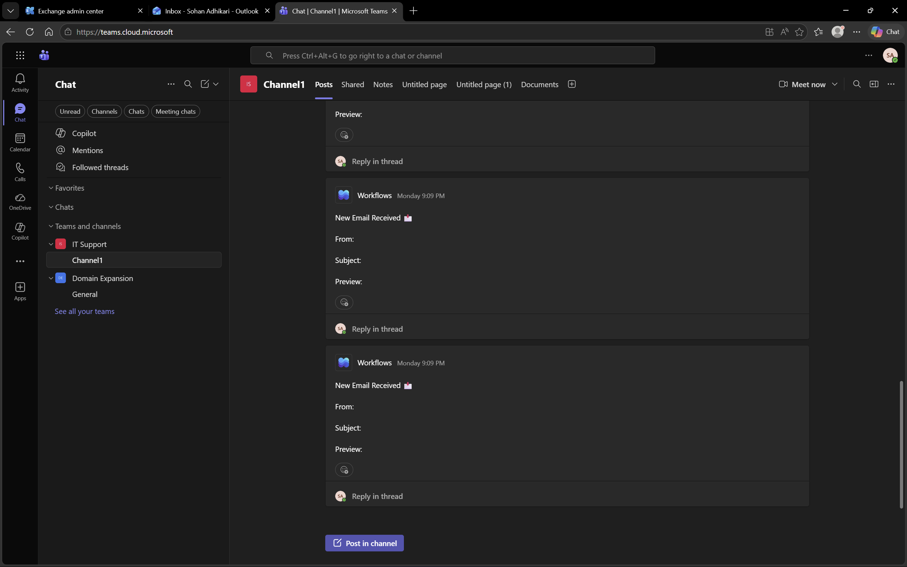

# Microsoft 365 – Microsoft Teams

## Objective
To explore collaboration and communication using Microsoft Teams.

## Environment
- Platform: Microsoft Teams
- Domain: DomainExpansion874.onmicrosoft.com
- Integration: Connected with Microsoft 365 and Entra ID

## Overview
Microsoft Teams is a collaboration platform enabling communication through chat, channels, and team-based workspaces.  
It allows users to collaborate in real-time, organize work, and share resources efficiently.

## Steps Performed
- Created a new team named "IT Support Lab"
- Added test users to the team
- Created and accessed a channel within the team
- Sent a message mentioning a user

## Screenshots

### Team Channel

### Teams Dashboard

### Message in Channel

## Outcome
Successfully created a team, configured a channel, and demonstrated communication among users.

## Key Learnings
- Teams enables real-time collaboration and communication
- Channels organize communication for specific topics or projects
- Users can mention others to draw attention and share resources efficiently