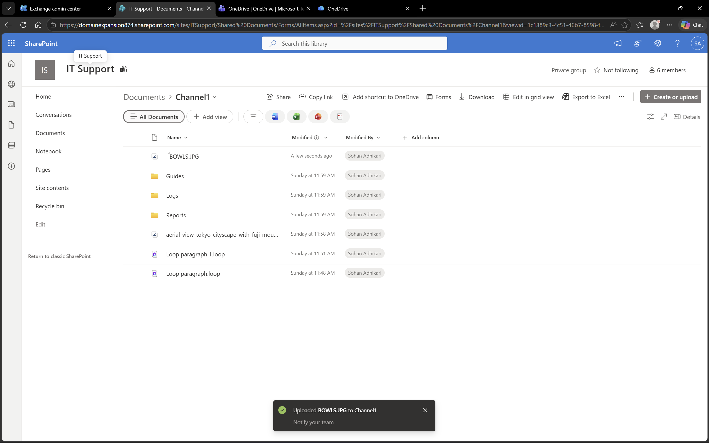
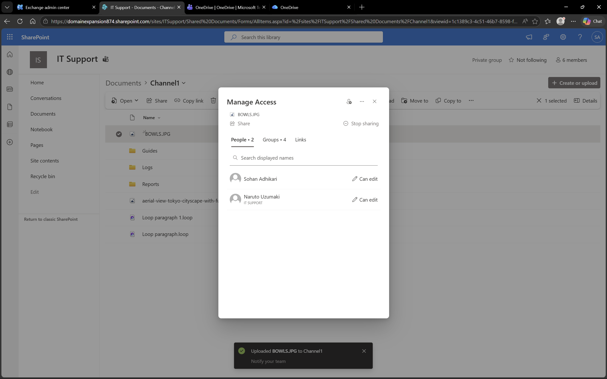

# Microsoft 365 – OneDrive

## Objective
To explore cloud storage and file sharing using Microsoft OneDrive.

## Environment
- Platform: OneDrive
- Domain: DomainExpansion874.onmicrosoft.com
- Integration: Connected with Microsoft 365 and Entra ID

## Overview
OneDrive is a cloud-based file storage and sharing platform.  
It allows users to securely store files, access them from anywhere, and share with other users with controlled permissions.

## Steps Performed
- Uploaded a file to OneDrive
- Accessed the uploaded file
- Clicked the Share button to configure permissions
- Shared the file with a test user
- Assigned appropriate permissions (view or edit)

## Screenshots

### File Upload

### File Sharing Settings

## Outcome
Successfully uploaded and shared a file in OneDrive, demonstrating file accessibility and permission management.

## Key Learnings
- OneDrive enables secure cloud storage
- Files can be shared with specific users
- Permissions can be controlled to allow view or edit access