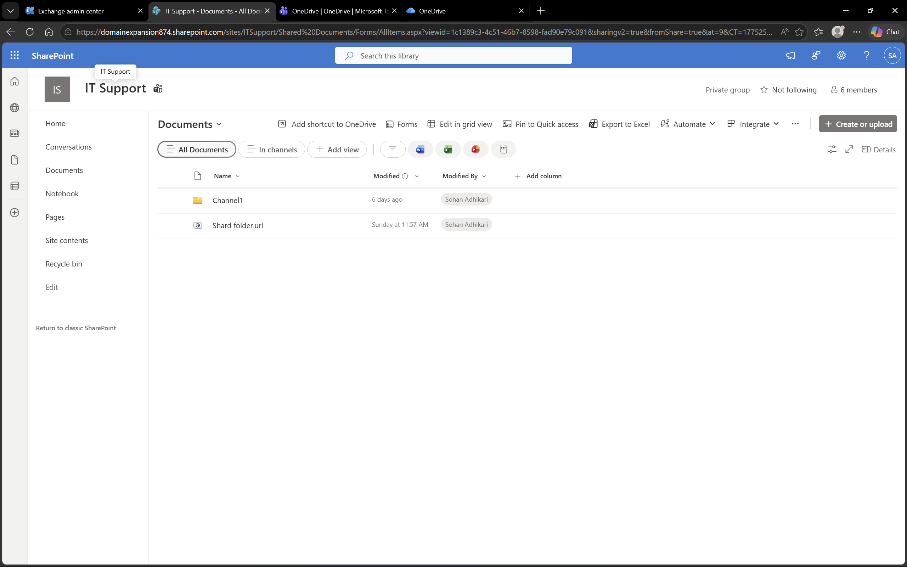
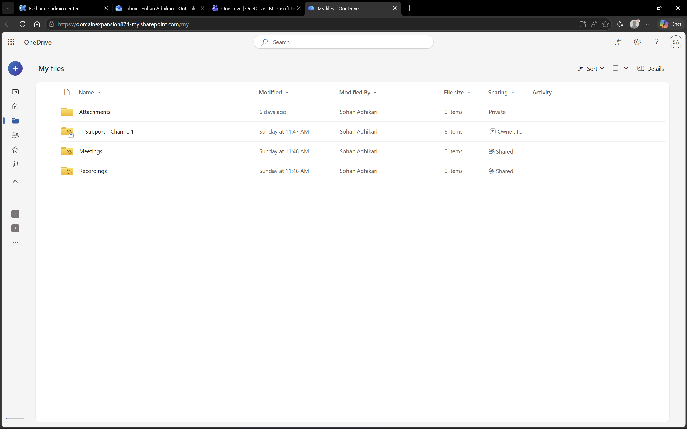
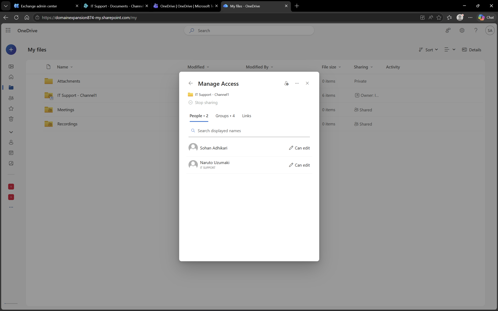

# Microsoft 365 – SharePoint

## Objective
To explore document management and collaboration using Microsoft SharePoint.

## Environment
- Platform: SharePoint
- Domain: DomainExpansion874.onmicrosoft.com
- Integration: Connected with Microsoft 365 and Entra ID

## Overview
SharePoint is a document management and collaboration platform that enables teams to store, organize, and share information securely.  
It provides centralized access to documents and supports permission-based access control.

## Steps Performed
- Created a new SharePoint site named "IT Support Lab"
- Accessed the site homepage
- Created or accessed a document library
- Uploaded test files to the library
- Reviewed site permissions and sharing settings

## Screenshots

### SharePoint Site Home

### Document Library

### Site Permissions

## Outcome
Successfully created a SharePoint site and managed documents and permissions.

## Key Learnings
- SharePoint enables centralized document management
- Permissions control access to site content
- Supports team collaboration through shared resources