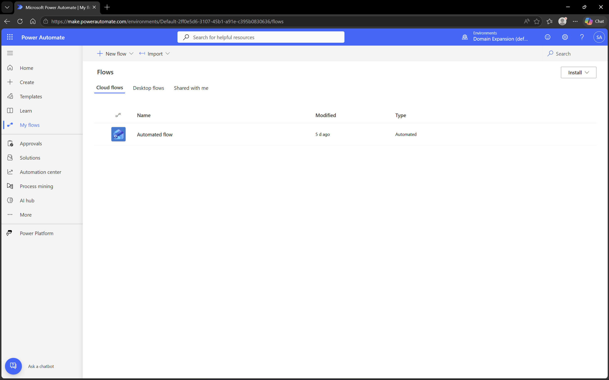
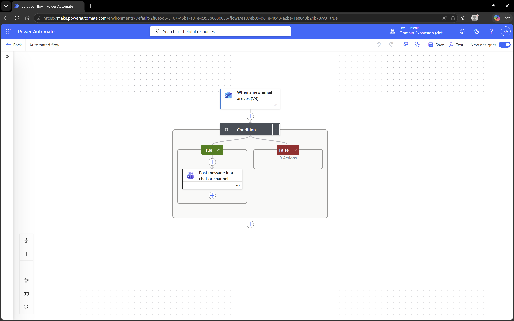
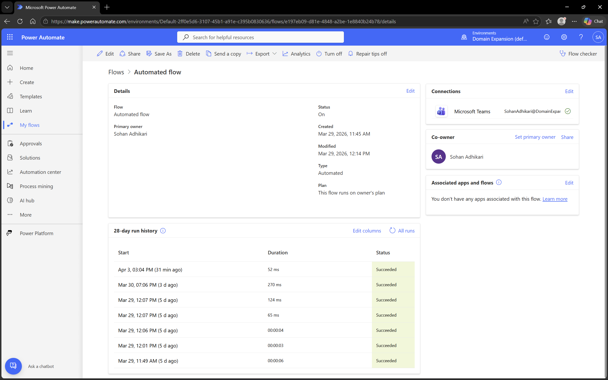

# Microsoft 365 – Power Automate

## Objective
To explore automation using Microsoft Power Automate and integrate Microsoft 365 apps for workflow efficiency.

## Environment
- Platform: Power Automate
- Domain: DomainExpansion874.onmicrosoft.com
- Integration: Microsoft 365 apps (Outlook, Teams)

## Overview
Power Automate allows users to create automated workflows between Microsoft 365 apps.  
In this example, an Outlook email is automatically forwarded to a Teams channel.

## Steps Performed
- Opened Power Automate portal
- Created a new automated cloud flow
- Configured **trigger**: When a new email arrives in Outlook
- Configured **action**: Post message in Teams channel
- Tested the flow by sending a test email to Outlook
- Verified message appeared in Teams

## Screenshots

### Flow Overview

### Flow Details

### Flow Run Successful

## Outcome
Successfully created a flow that forwards Outlook messages to a Teams channel, demonstrating app integration and automation.

## Key Learnings
- Power Automate enables workflow automation across Microsoft 365 apps
- Flows consist of triggers and actions
- Testing ensures workflows run as expected