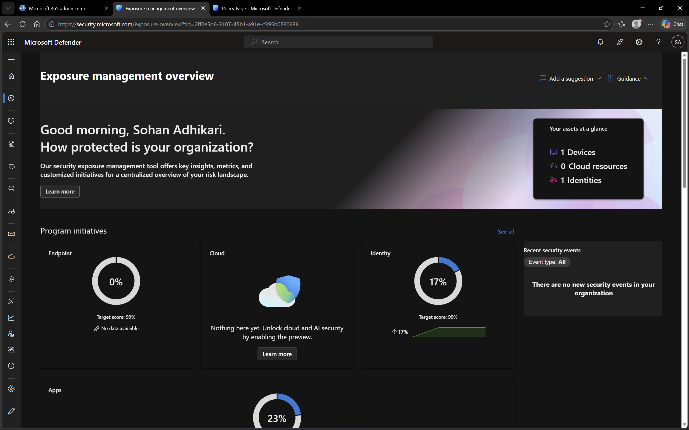

# Microsoft Defender – Overview

## Objective
To explore and understand the Microsoft Defender dashboard and its role in monitoring security posture across devices and users.

## Environment
- Platform: Microsoft Defender
- Domain: DomainExpansion874.onmicrosoft.com
- Integration: Connected with Microsoft Entra ID

## Overview
Microsoft Defender provides a centralized dashboard to monitor security status, threats, and device health across the organization.

The dashboard includes insights into security alerts, device inventory, and recommendations to improve the overall security posture.

## Steps Performed
- Accessed Microsoft Defender portal
- Navigated to the main dashboard
- Reviewed security overview and available insights

## Screenshots

### Defender Dashboard

## Outcome
Successfully explored the Microsoft Defender dashboard and understood how it provides visibility into organizational security.

## Key Learnings
- Microsoft Defender offers centralized security monitoring
- It provides visibility into threats, alerts, and device status
- It integrates with other Microsoft services like Entra ID and Intune