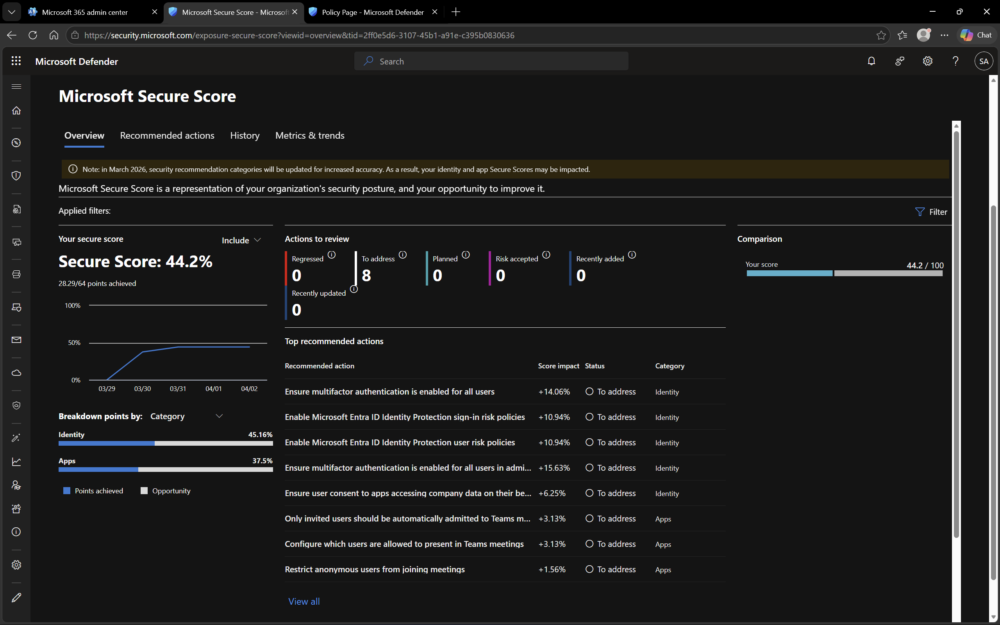
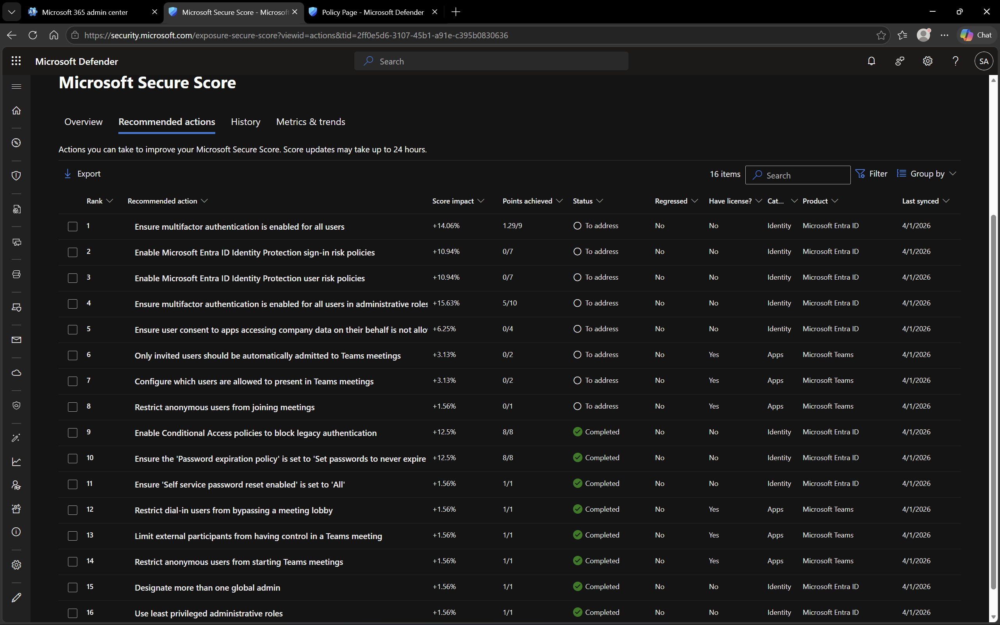

# Microsoft Defender – Security Score

## Objective
To analyze the security posture using Microsoft Defender Security Score and understand recommended actions.

## Environment
- Platform: Microsoft Defender
- Domain: DomainExpansion874.onmicrosoft.com

## Overview
The Security Score in Microsoft Defender provides a numerical representation of the organization’s security posture.

It includes recommendations that help improve protection against threats and vulnerabilities.

## Steps Performed
- Navigated to Security Score section
- Reviewed current score
- Analyzed recommended improvement actions

## Screenshots

### Security Score Dashboard

### Recommendations

## Outcome
Understood how Microsoft Defender evaluates security posture and provides actionable recommendations.

## Key Learnings
- Security Score reflects overall security posture
- Recommendations help improve system protection
- Continuous monitoring is required to maintain security