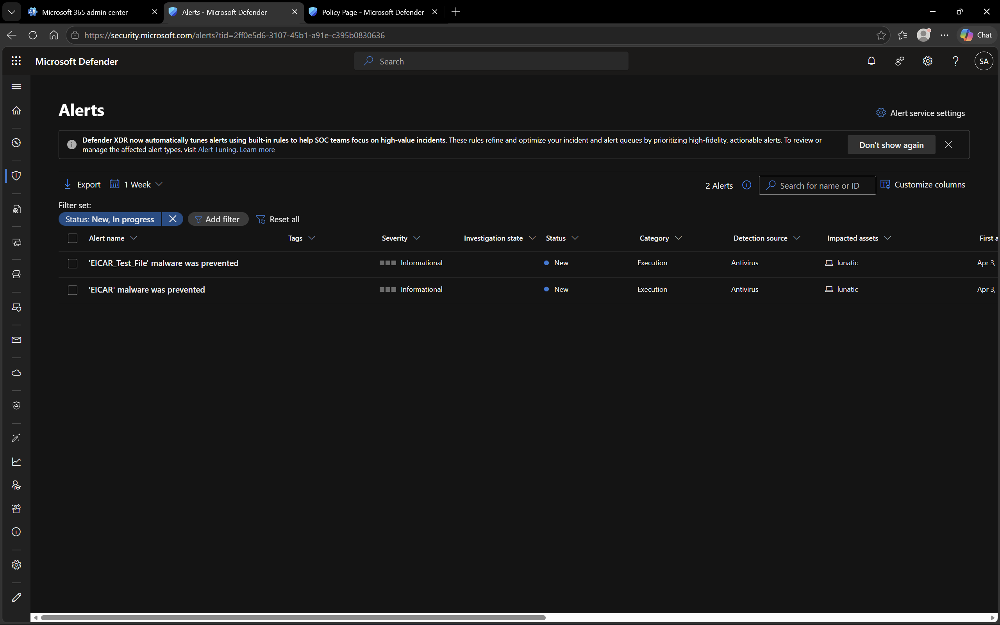
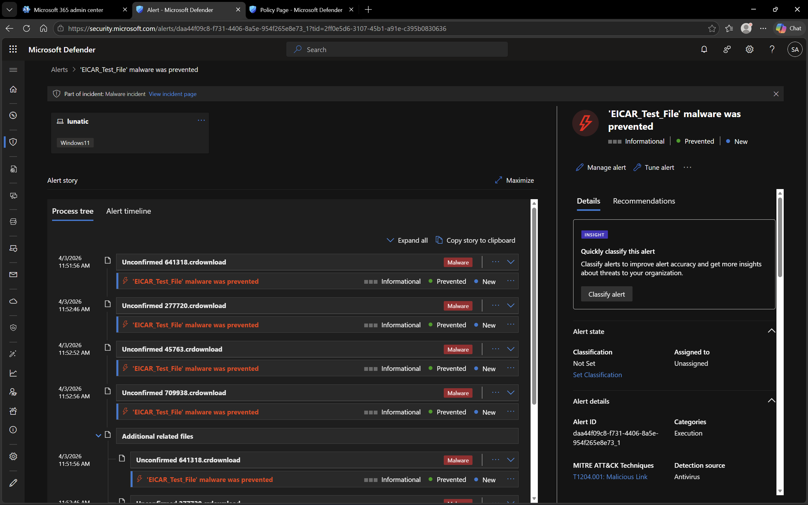

# Microsoft Defender – Incidents and Alerts

## Objective
To explore how Microsoft Defender detects, generates, and displays security alerts and incidents.

## Environment
- Platform: Microsoft Defender
- Domain: DomainExpansion874.onmicrosoft.com

## Overview
Microsoft Defender generates alerts and incidents when suspicious or malicious activity is detected on onboarded devices.

These alerts provide detailed information about threats, affected devices, and processes involved.

## Steps Performed
- Navigated to Incidents and Alerts section
- Reviewed list of generated alerts
- Opened alert details for deeper investigation
- Analyzed process tree associated with the alert

## Screenshots

### Alerts List

### Alert Details (Process Tree)

## Outcome
Successfully explored how alerts are generated and investigated in Microsoft Defender.

## Key Learnings
- Microsoft Defender detects suspicious activities and generates alerts
- Alerts can be grouped into incidents for easier management
- Process tree helps visualize how a threat originated and executed
- Security teams can investigate and respond to threats effectively