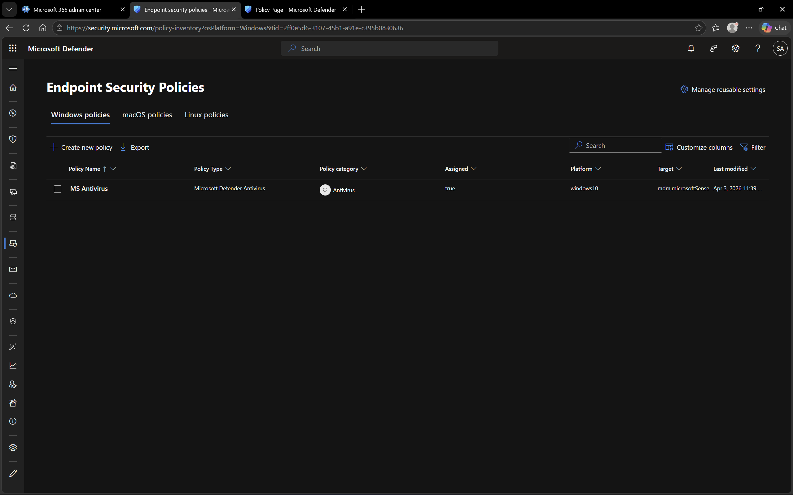

# Microsoft Defender – Security Policies

## Objective
To understand how security policies are configured and applied to protect devices.

## Environment
- Platform: Microsoft Defender
- Domain: DomainExpansion874.onmicrosoft.com

## Overview
Security policies in Microsoft Defender help enforce protection settings such as antivirus, real-time protection, and threat detection.

These policies ensure devices remain secure and compliant.

## Steps Performed
- Navigated to Endpoint Security policies
- Reviewed configured antivirus and security settings
- Verified policy assignment to devices

## Screenshots

### Endpoint Security Policies

## Outcome
Understood how security policies are used to protect devices in an organization.

## Key Learnings
- Policies enforce consistent security settings
- Antivirus and real-time protection are critical components
- Policies can be assigned to devices for centralized control