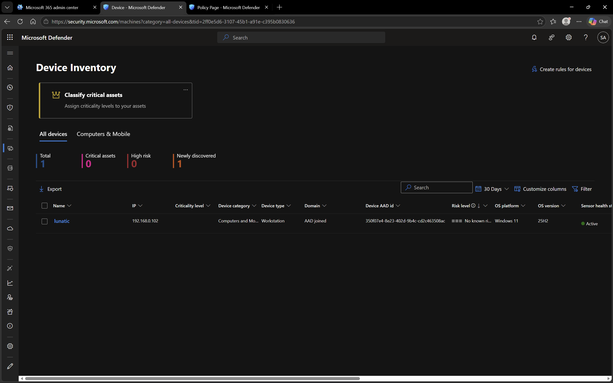

# Microsoft Defender – Device Inventory

## Objective
To explore device onboarding and monitoring in Microsoft Defender.

## Environment
- Platform: Microsoft Defender
- Domain: DomainExpansion874.onmicrosoft.com

## Overview
Microsoft Defender provides visibility into all onboarded devices, including their health status, risk level, and security posture.

## Steps Performed
- Navigated to Device Inventory
- Reviewed onboarded device details
- Verified device health and risk status

## Screenshots

### Device Inventory

## Outcome
Successfully verified device onboarding and monitoring in Microsoft Defender.

## Key Learnings
- Devices must be onboarded to enable monitoring
- Defender provides real-time visibility into device security
- Device health and risk levels help prioritize actions