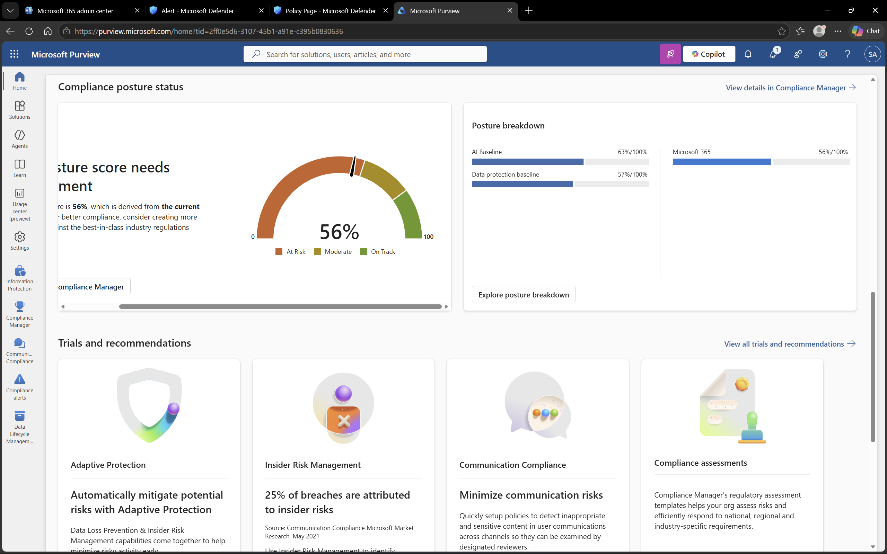

# Microsoft Purview – Overview

## Objective
To explore Microsoft Purview and understand its role in data governance, compliance, and information protection.

## Environment
- Platform: Microsoft Purview
- Domain: DomainExpansion874.onmicrosoft.com
- Integration: Connected with Microsoft 365 services

## Overview
Microsoft Purview is a compliance and data governance solution that helps organizations manage and protect their data.

It provides tools for monitoring compliance status, managing risks, and enforcing data protection policies.

## Steps Performed
- Accessed Microsoft Purview portal
- Navigated to the main dashboard
- Reviewed compliance status and available insights

## Screenshots

### Purview Dashboard

## Outcome
Successfully explored the Microsoft Purview dashboard and understood its role in managing compliance and data protection.

## Key Learnings
- Microsoft Purview helps manage compliance and data governance
- It provides visibility into organizational compliance posture
- It integrates with Microsoft 365 services for data protection