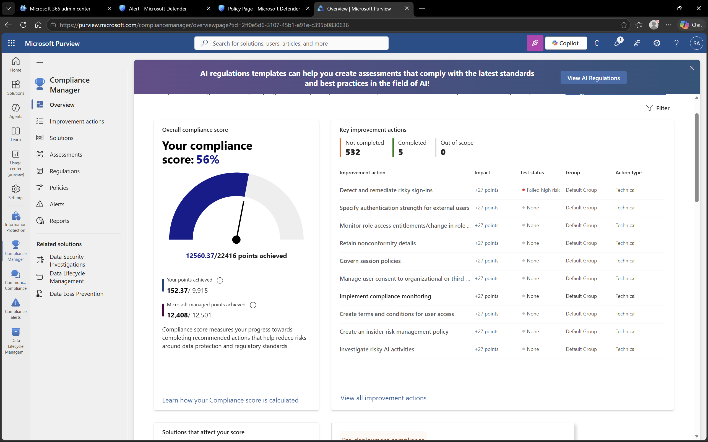
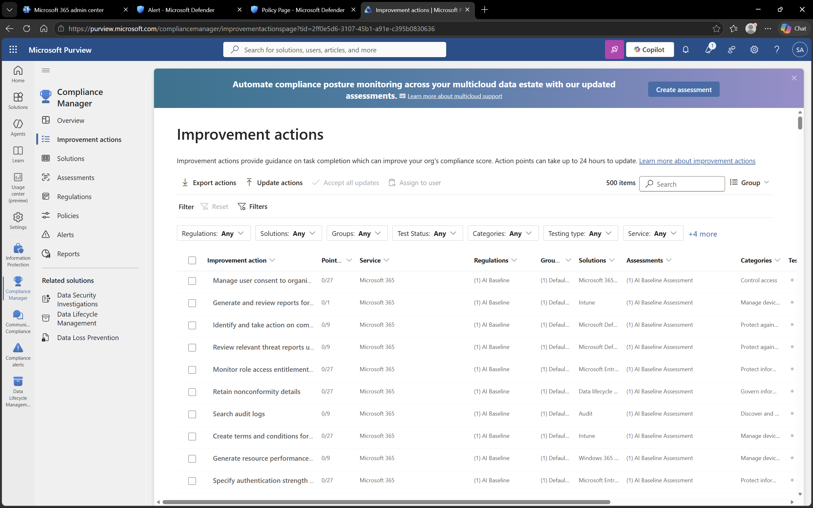

# Microsoft Purview – Compliance Manager

## Objective
To evaluate the organization’s compliance posture using Microsoft Purview Compliance Manager.

## Environment
- Platform: Microsoft Purview
- Domain: DomainExpansion874.onmicrosoft.com

## Overview
Compliance Manager provides a compliance score that reflects how well the organization is aligned with recommended security and regulatory standards.

It also provides improvement actions to help enhance data protection and compliance posture.

## Steps Performed
- Navigated to Compliance Manager
- Reviewed current compliance score
- Analyzed recommended improvement actions
- Updated improvement actions status (simulated implementation)

## Screenshots

### Compliance Score

### Recommended Actions

## Outcome
Understood how Microsoft Purview measures compliance and provides actionable insights to improve security posture.

## Key Learnings
- Compliance score reflects organizational readiness for regulatory standards
- Improvement actions help guide security and compliance enhancements
- Regular monitoring and updates are required to maintain compliance