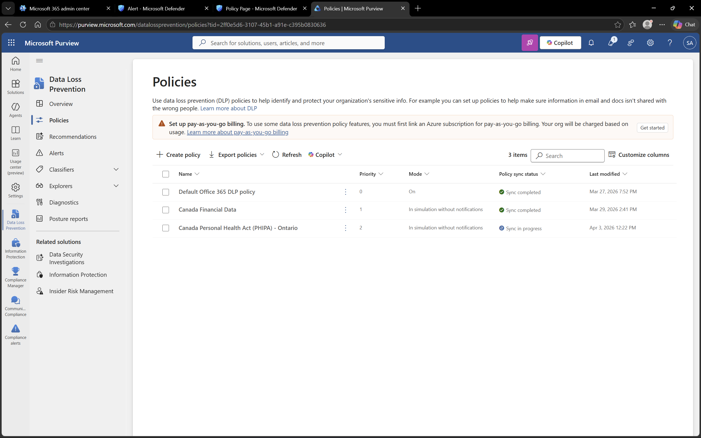

# Microsoft Purview – Data Loss Prevention (DLP)

## Objective
To understand how Data Loss Prevention (DLP) policies are used to protect sensitive information.

## Environment
- Platform: Microsoft Purview
- Domain: DomainExpansion874.onmicrosoft.com

## Overview
Data Loss Prevention (DLP) policies help prevent sensitive information from being shared, leaked, or accessed improperly.

These policies monitor and control data across services like Exchange and OneDrive.

## Steps Performed
- Navigated to Data Loss Prevention section
- Reviewed configured DLP policies
- Analyzed policy scope and coverage

## Screenshots

### DLP Policies

## Outcome
Understood how DLP policies help protect sensitive data across organizational platforms.

## Key Learnings
- DLP policies prevent data leakage
- They apply to multiple Microsoft 365 services
- They help enforce data protection rules across the organization