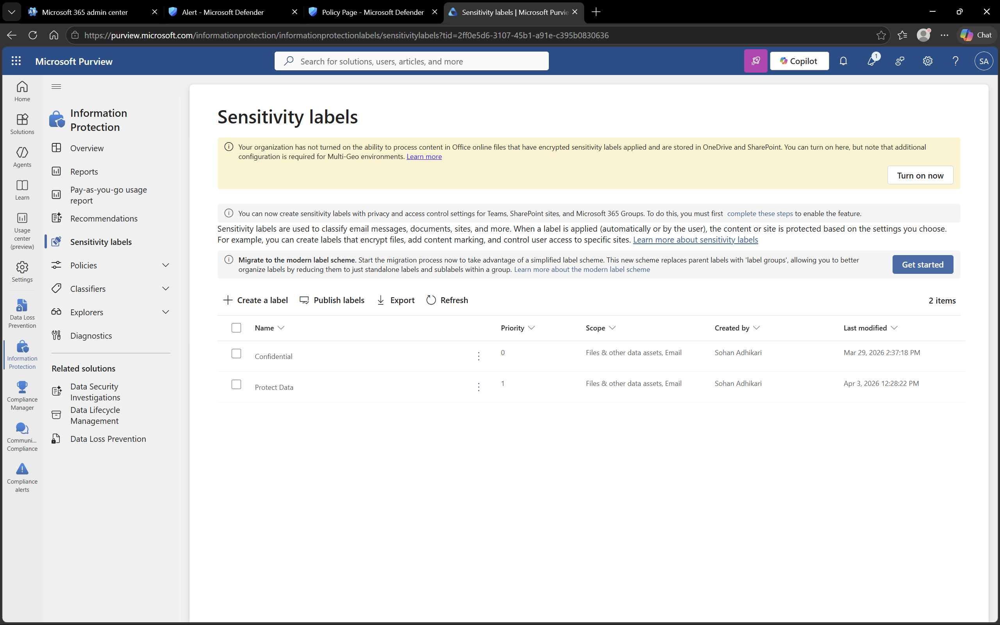
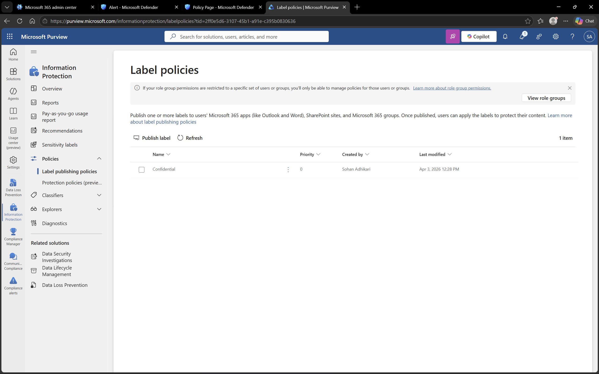

# Microsoft Purview – Information Protection

## Objective
To understand how sensitivity labels and label policies are used to classify and protect organizational data.

## Environment
- Platform: Microsoft Purview
- Domain: DomainExpansion874.onmicrosoft.com

## Overview
Information Protection in Microsoft Purview enables organizations to classify and protect data using sensitivity labels.

These labels help identify sensitive content and apply protection policies such as access control and data handling rules.

## Steps Performed
- Navigated to Information Protection section
- Reviewed sensitivity labels
- Reviewed label publishing policies
- Verified label availability for users

## Screenshots

### Sensitivity Labels

### Label Policies

## Outcome
Understood how sensitivity labels are created and published to protect organizational data.

## Key Learnings
- Sensitivity labels classify data based on sensitivity level
- Label policies make labels available to users
- Data classification is essential for security and compliance