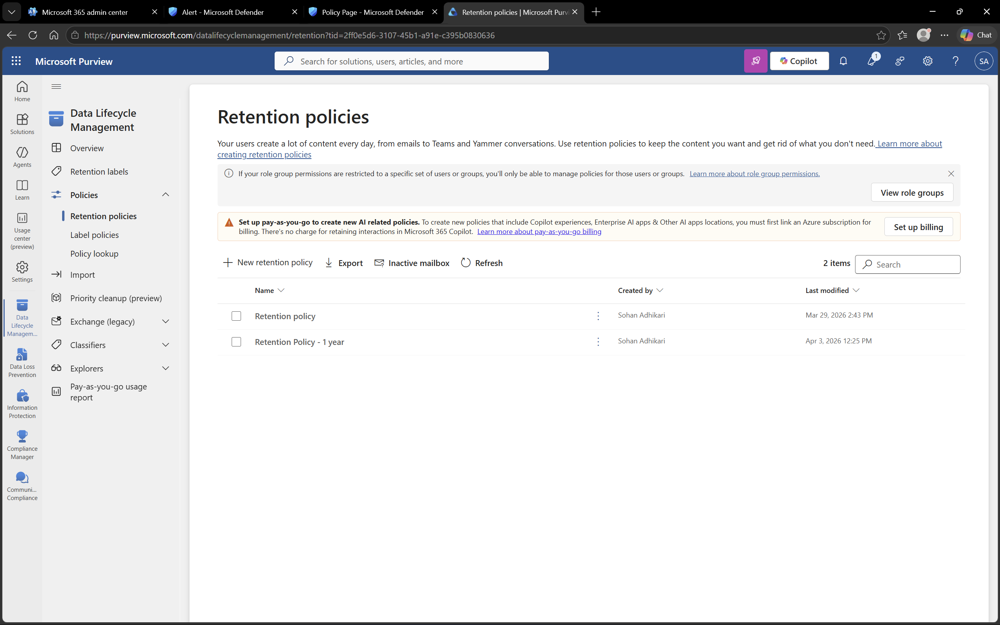

# Microsoft Purview – Retention Policies

## Objective
To understand how retention policies are used to manage data lifecycle and compliance.

## Environment
- Platform: Microsoft Purview
- Domain: DomainExpansion874.onmicrosoft.com

## Overview
Retention policies help organizations manage how long data is retained and when it is deleted.

These policies ensure compliance with organizational and regulatory requirements.

## Steps Performed
- Navigated to Data Lifecycle Management
- Reviewed configured retention policies
- Verified scope and duration settings

## Screenshots

### Retention Policies

## Outcome
Understood how retention policies help manage data lifecycle and ensure compliance.

## Key Learnings
- Retention policies control how long data is stored
- They help meet compliance and regulatory requirements
- Proper data lifecycle management improves security and organization