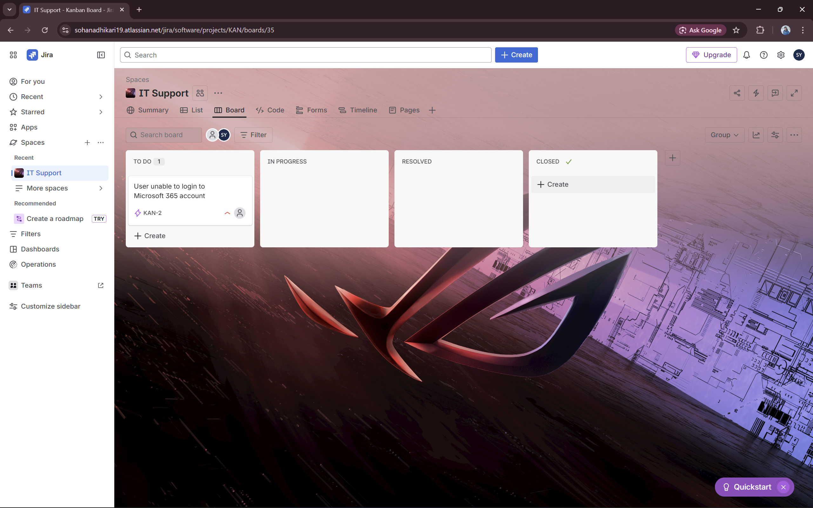
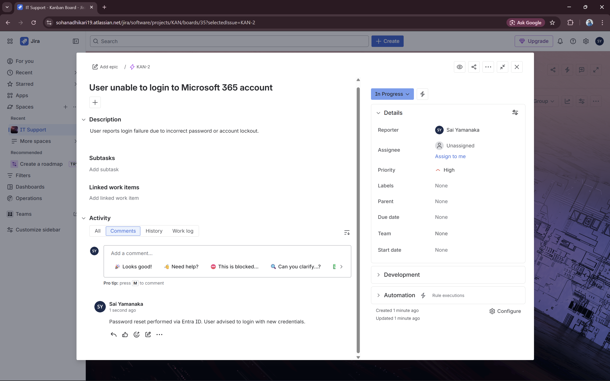
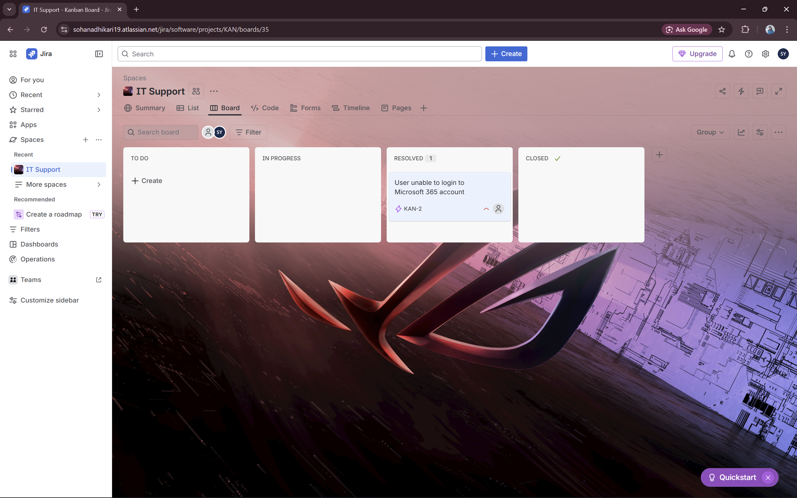

# Ticket 1 – Password Reset

## Summary
User unable to login to Microsoft 365 account

## Description
User reports being unable to login to Microsoft 365 account. The login fails with 'Incorrect password' error. The user attempted restarting their computer and clearing the browser cache, but the issue persisted.

## Reporter
Test user (simulated via Gmail + trick)

## Assignee
Sohan Adhikari

## Workflow
1. **TO DO** – Ticket created  
   
2. **IN PROGRESS** – Started troubleshooting  
   
3. **Comment** – Password reset performed via Entra ID  
   
4. **RESOLVED** – Issue fixed  
   
5. **CLOSED** – Final confirmation
   

## Solution
Password was reset via Microsoft Entra ID. User was advised to login with new credentials.

## Key Learnings
- Understanding of IT ticket lifecycle in Jira Service Management  
- Integration of Active Directory / Entra ID for account management  
- Proper documentation for tracking and knowledge base purposes