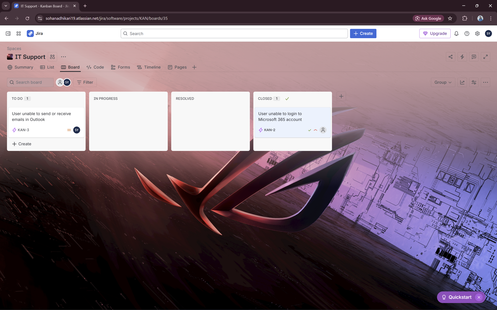
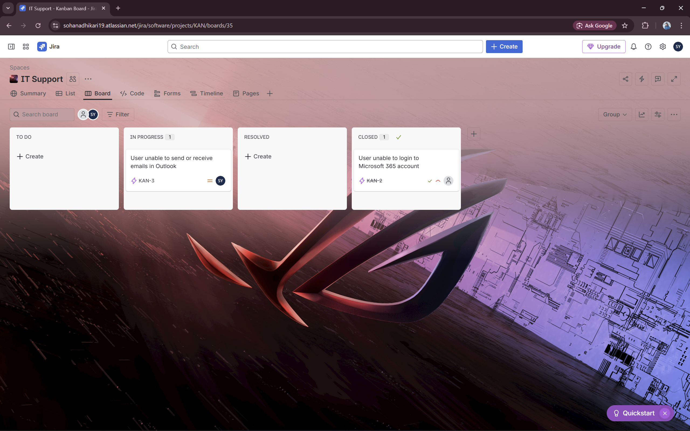
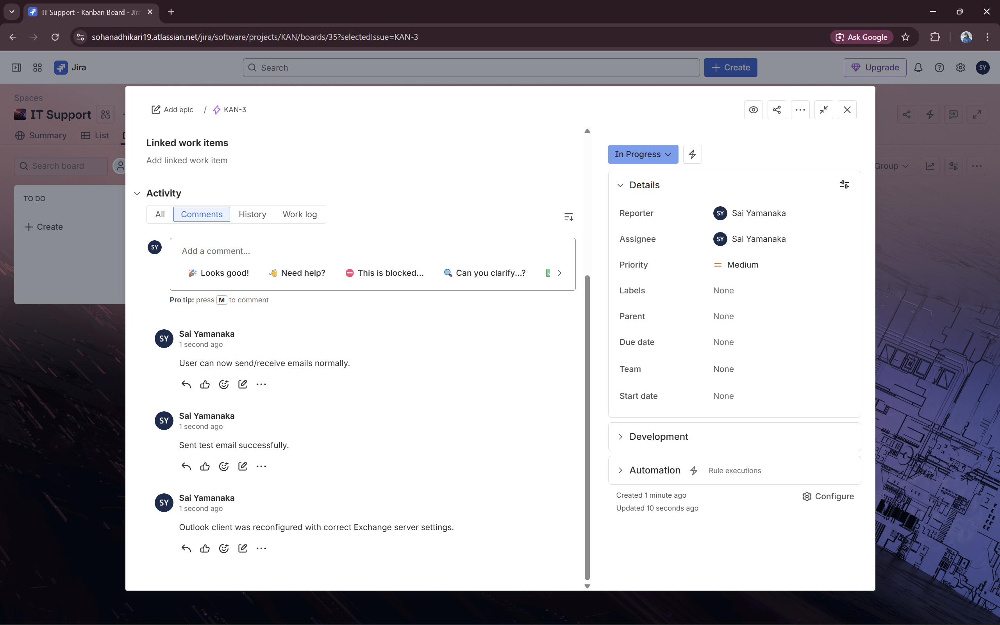
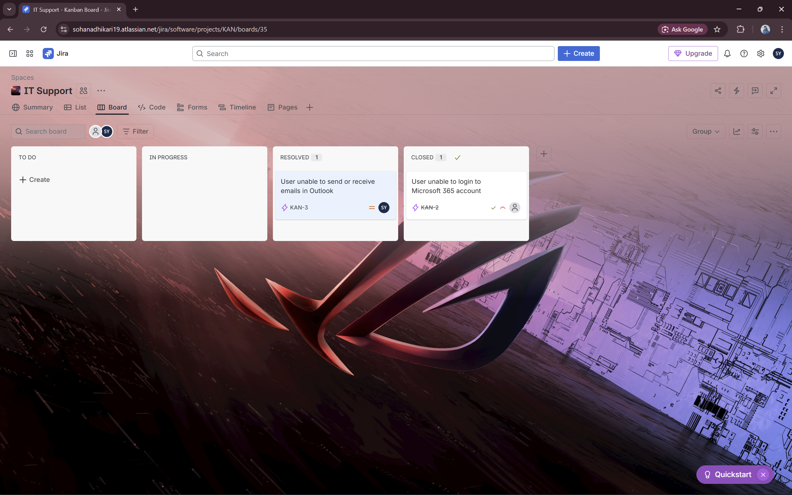
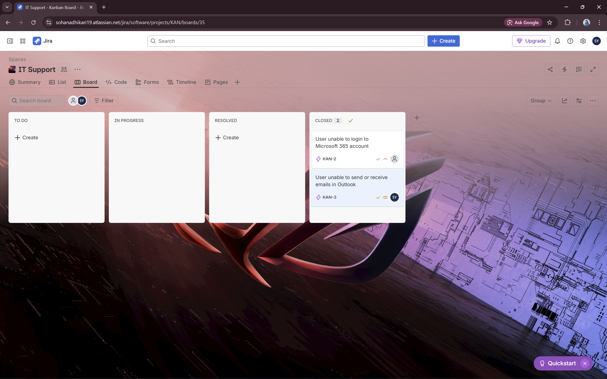

# Ticket 2 – Email Issue

## Summary
User unable to send or receive emails in Outlook

## Description
User reports that they cannot send or receive emails in Outlook.  
The issue started today.  
User tried restarting Outlook and checking internet connection, but the problem persists.  
No error messages displayed in the Outlook client.

## Reporter
Sai Yamanaka 

## Assignee
Sai Yamanaka

## Workflow
1. **TO DO** – Ticket created  
   
2. **IN PROGRESS** – Started troubleshooting  
   
3. **Comment** – Actions performed: checked Exchange settings, tested sending email  
   
4. **RESOLVED** – Issue fixed  
   
5. **CLOSED** – Final confirmation
   

## Solution
Outlook client was reconfigured with correct Exchange server settings.  
Test email sent successfully.  
User can now send and receive emails normally.

## Key Learnings
- Troubleshooting email issues in Microsoft 365 / Outlook  
- Understanding interaction between Outlook client and Exchange Online  
- Documenting IT support workflow for future knowledge base