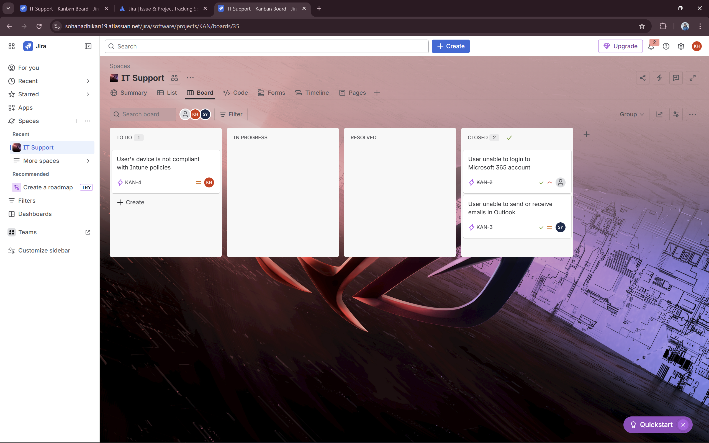
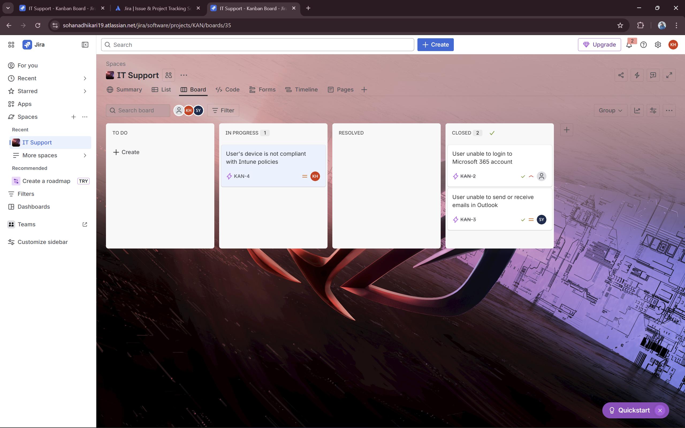
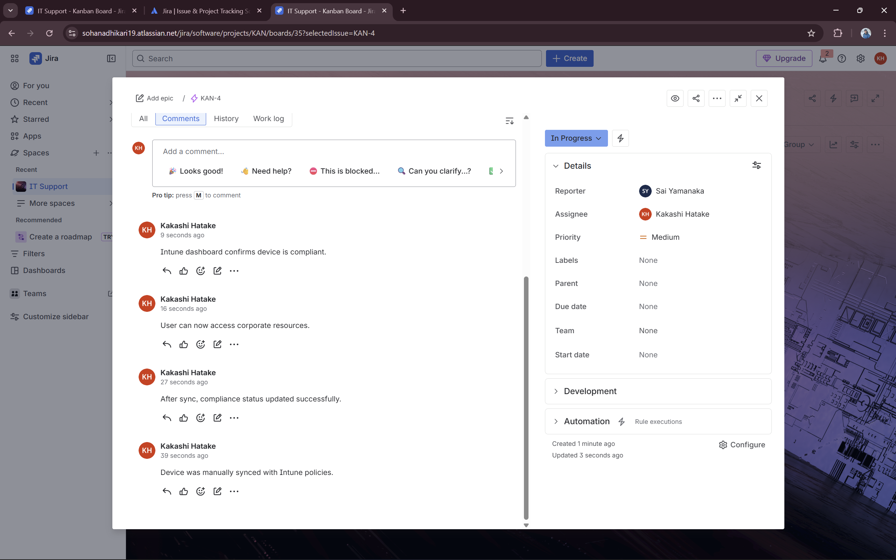
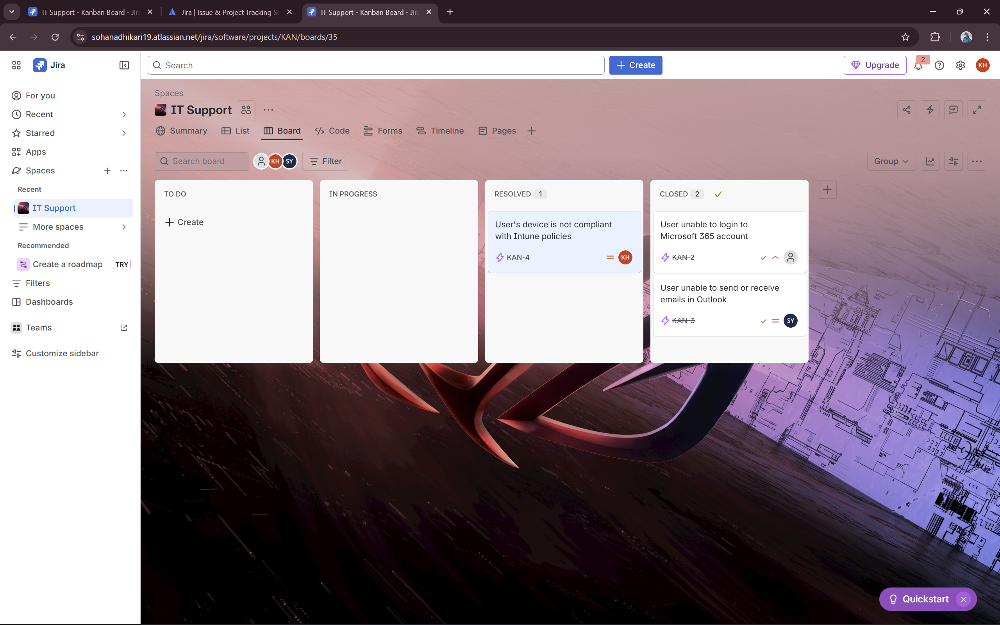
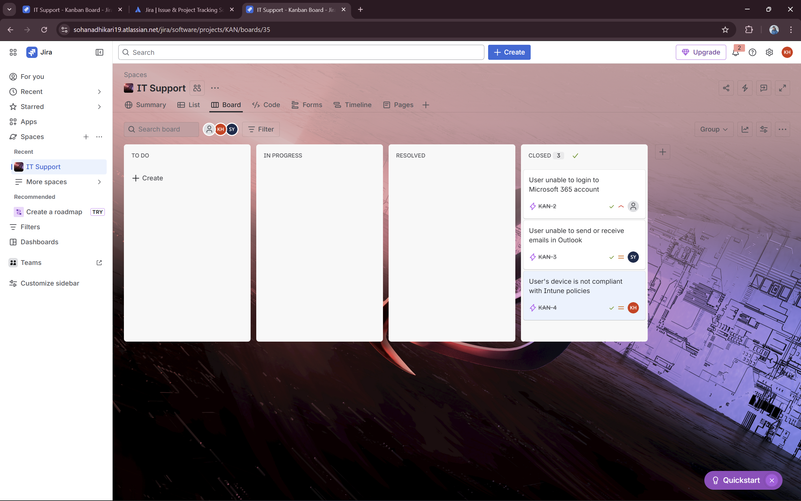

# Ticket 3 – Device Issue / Intune Compliance

## Summary
User’s device is not compliant with Intune policies

## Description
User reports that their device is showing a non-compliant status in Microsoft Intune.  
Device: Windows 10 laptop  
Issue: Device cannot access corporate resources until compliance is restored.  
Steps attempted: User restarted the device and synced Intune policies manually; issue persists.

## Reporter
Sai Yamanaka

## Assignee
Kakashi Hatake

## Workflow
1. **TO DO** – Ticket created  
   
2. **IN PROGRESS** – Started troubleshooting  
   
3. **Comment** – Actions performed: forced policy sync, reviewed Intune compliance reports  
   
4. **RESOLVED** – Issue fixed  
   
5. **CLOSED** – Final confirmation
   

## Solution
Device was manually synced with Intune policies.  
After sync, compliance status updated successfully.  
User can now access corporate resources.  
Intune dashboard confirms device is compliant.

## Key Learnings
- Troubleshooting Intune device compliance issues  
- Understanding how policy sync affects device access  
- Documenting IT workflow for compliance and knowledge base