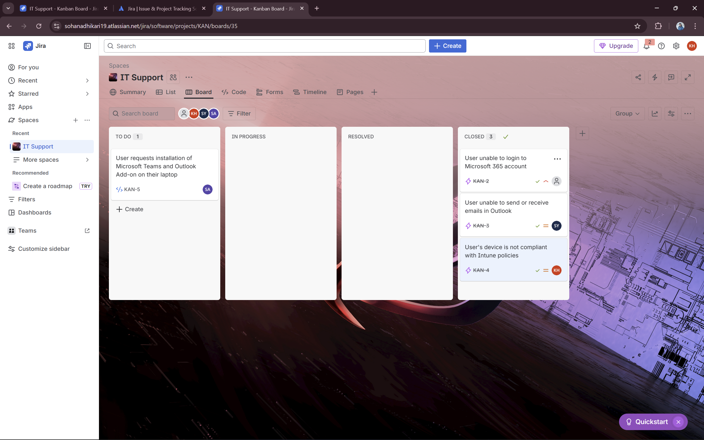
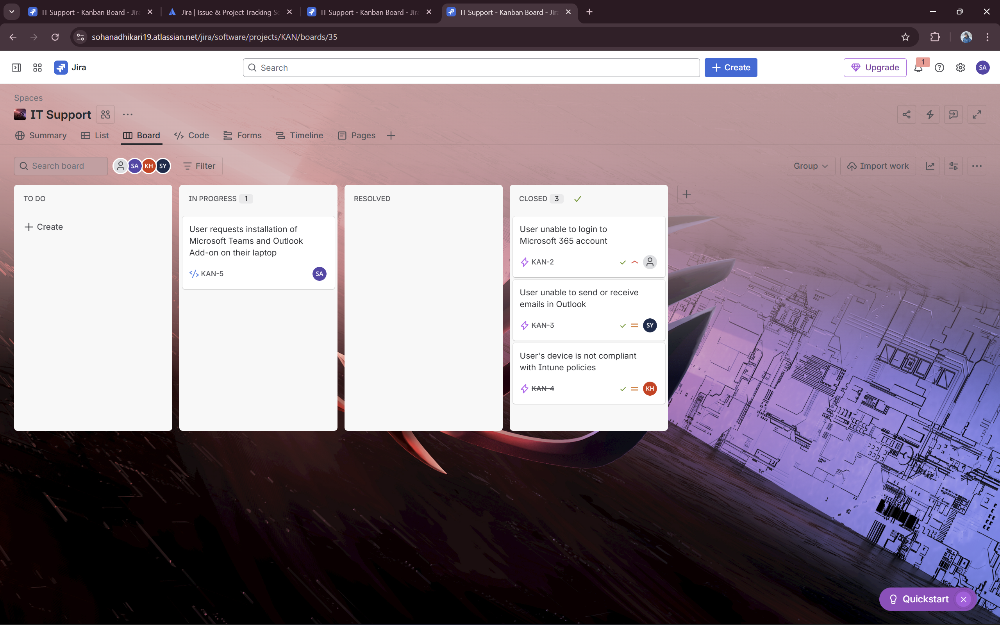
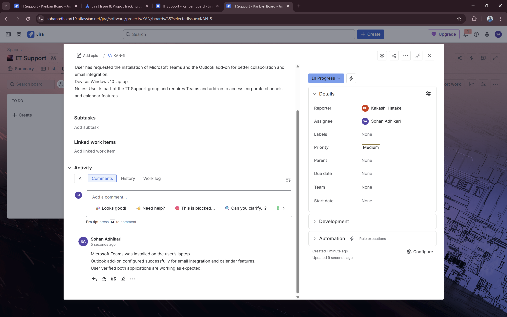
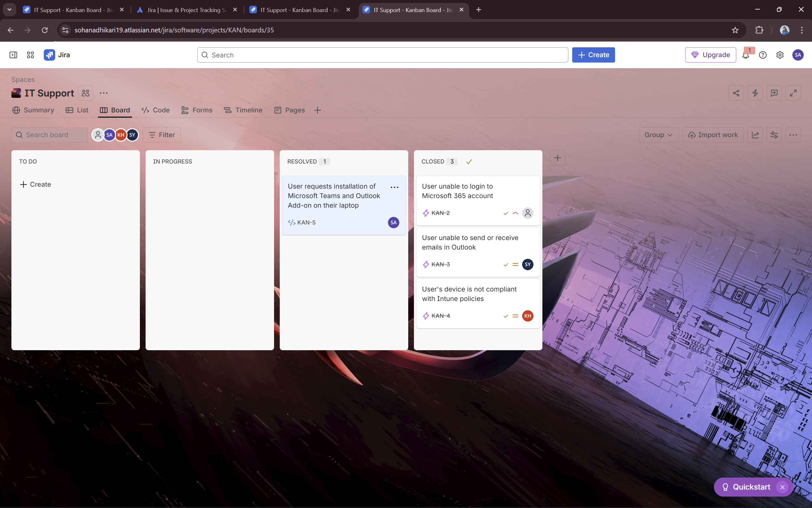
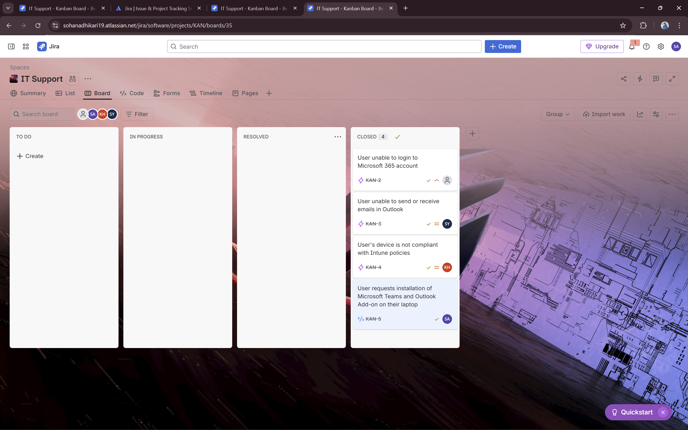

# Ticket 4 – Service Request: Install Microsoft Teams / Outlook Add-on

## Summary
User requests installation of Microsoft Teams and Outlook Add-on on their laptop

## Description
User has requested the installation of Microsoft Teams and the Outlook add-on for better collaboration and email integration.  
Device: Windows 10 laptop  
Notes: User is part of the IT Support group and requires Teams and add-on to access corporate channels and calendar features.

## Reporter
Kakashi Hatake

## Assignee
Sohan Adhikari

## Workflow
1. **TO DO** – Ticket created  
   
2. **IN PROGRESS** – Installation started  
   
3. **Comment** – Actions performed: installed Teams, configured Outlook add-on  
   
4. **RESOLVED** – Installation complete  
   
5. **CLOSED** – User confirmed everything works
   
## Solution
Microsoft Teams was installed on the user’s laptop.  
Outlook add-on configured successfully for email integration and calendar features.  
User verified both applications are working as expected.  
Ticket marked as CLOSED.

## Key Learnings
- Handling service requests in Jira / IT support workflow  
- Installing and configuring collaboration tools for end-users  
- Documenting service requests and solutions for knowledge base