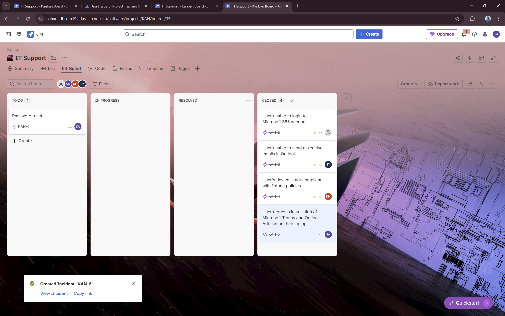
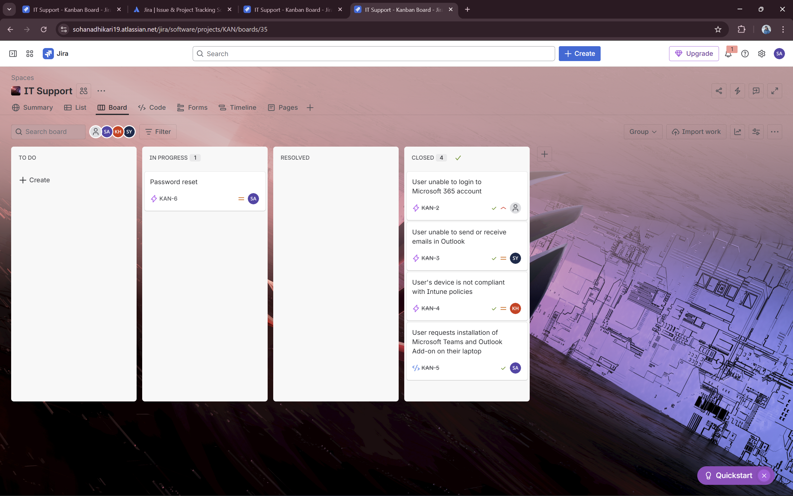
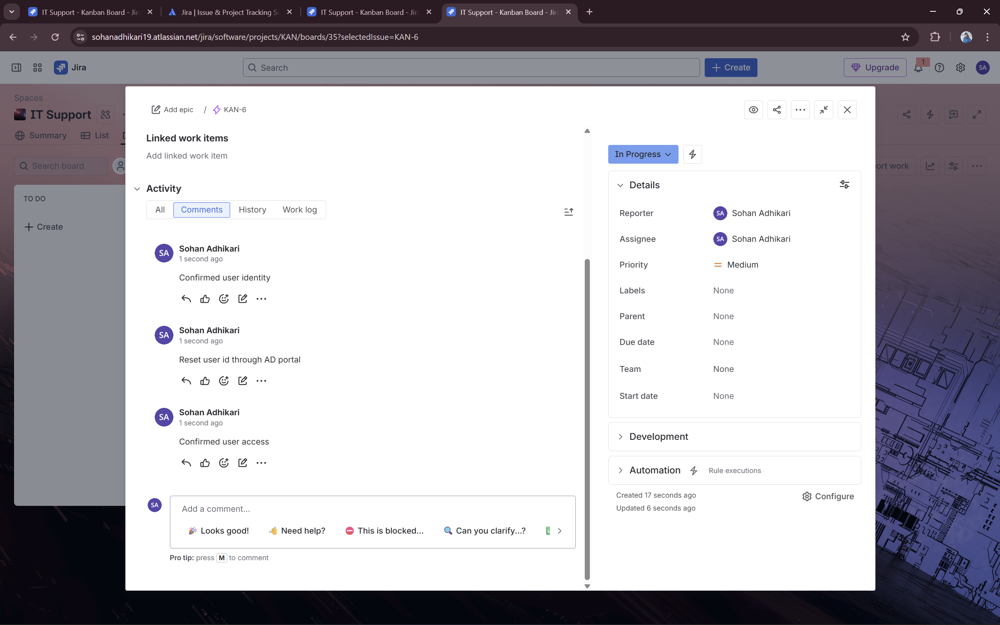
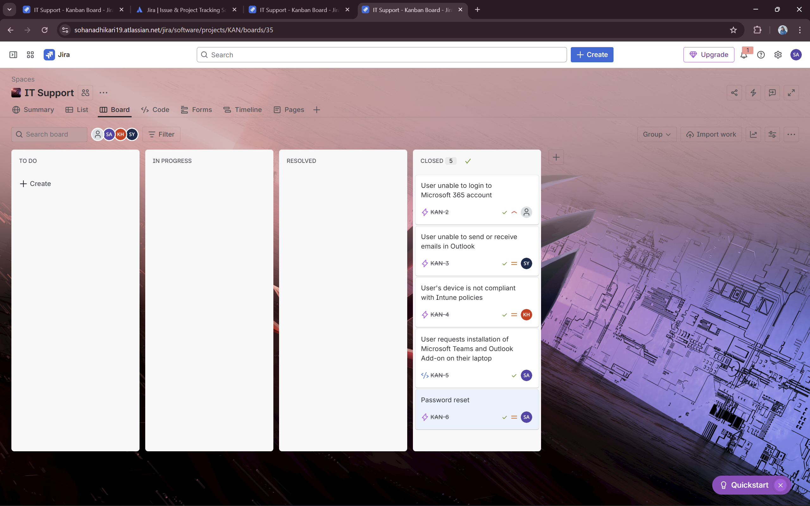

# Ticket 5 – Password Reset / Account Lockout

## Summary
User account locked out and requested password reset

## Description
User reports that they cannot log in to their domain account.  
Device: Windows 10 laptop  
Issue: Account locked after multiple incorrect login attempts.  
Steps attempted by user: Tried logging in several times; still locked out.  

## Reporter
Sohan Adhikari

## Assignee
Sohan Adhikari (Self-Assigned)

## Workflow
1. **TO DO** – Ticket created  
   
2. **IN PROGRESS** – Started troubleshooting  
   
3. **Comment** – Actions performed: verified user account status, unlocked account in Active Directory, reset password  
   
4. **RESOLVED** – Account unlocked and password reset successfully  
   
5. **CLOSED** – User confirmed they can log in  
   

## Solution
- Account unlocked in Active Directory  
- Password reset performed  
- User successfully logged in and confirmed access  

## Key Learnings
- Handling account lockouts and password reset incidents  
- Documenting troubleshooting steps and resolution for knowledge base  
- Understanding Active Directory account management workflow